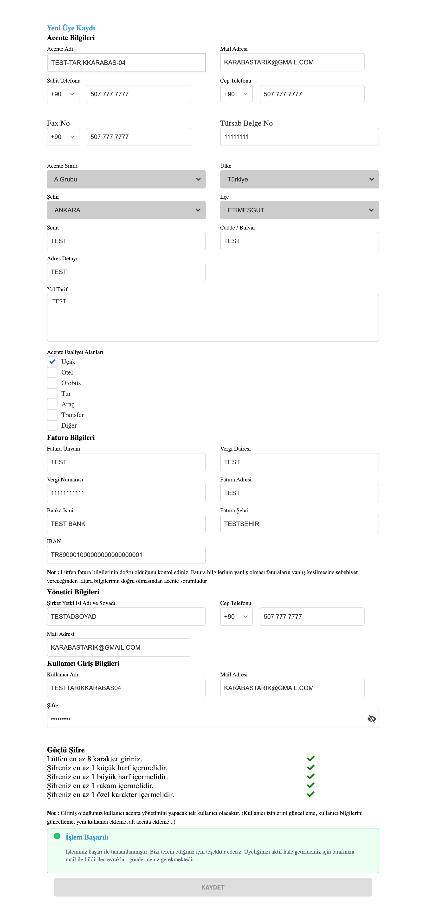
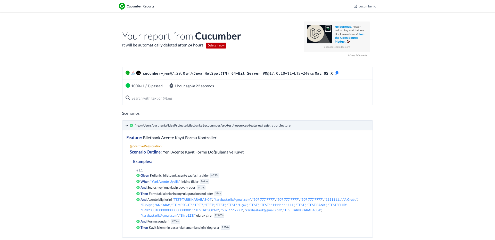

# Biletbank E2E Cucumber Test Automation Project

Bu proje, Biletbank platformunun uçtan uca (E2E) süreçlerini doğrulamak amacıyla oluşturulmuş, Selenium ve Cucumber tabanlı bir test otomasyon framework'üdür.

## 🚀 Kullanılan Teknolojiler & Framework Yapısı

Bu projede **Behavior Driven Development (BDD)** yaklaşımı benimsenmiştir:

* **Dil:** Java
* **Test Framework:** Cucumber (JUnit)
* **Otomasyon Aracı:** Selenium WebDriver
* **Tasarım Deseni:** Page Object Model (POM)
* **Raporlama:** Cucumber HTML Reports / JUnit
* **Veri Yönetimi:** Apache POI (Excel işlemleri için)

## 📂 Proje Klasör Yapısı (Framework Template)

```text
src
├── test
│   ├── java
│   │   └── biletbank
│   │       ├── pages          # Page Object sınıfları (Locators & Methods)
│   │       ├── runners        # Testleri çalıştıran Runner sınıfları
│   │       ├── stepDefs       # Feature dosyalarının Java karşılıkları
│   │       └── utilities      # Driver, ReusableMethods, ConfigurationReader vb.
│   └── resources
│       ├── features           # Gherkin dilinde (Given, When, Then) test senaryoları
│       └── cucumber.properties # Cucumber konfigürasyonları
├── configuration.properties   # Ortam değişkenleri (URL, Browser vb.)
└── pom.xml                    # Bağımlılık yönetimi (Maven)
```


## 🔍 Test Çıktıları ve Kanıtlar

Projenin çalışma başarısını gösteren uygulama ekranı ve teknik rapor çıktıları aşağıdadır:

### 🖥️ Test Sayfası (Kayıt Onay Ekranı)
Otomasyonun formu eksiksiz doldurduğunu ve uygulamanın "İşlem Başarılı" yanıtını verdiğini gösteren ekran görüntüsü:



### 📊 Test Raporu (Cucumber Report)
Senaryo adımlarının (Gherkin) çalışma sürelerini ve geçme durumlarını gösteren detaylı rapor çıktısı:


